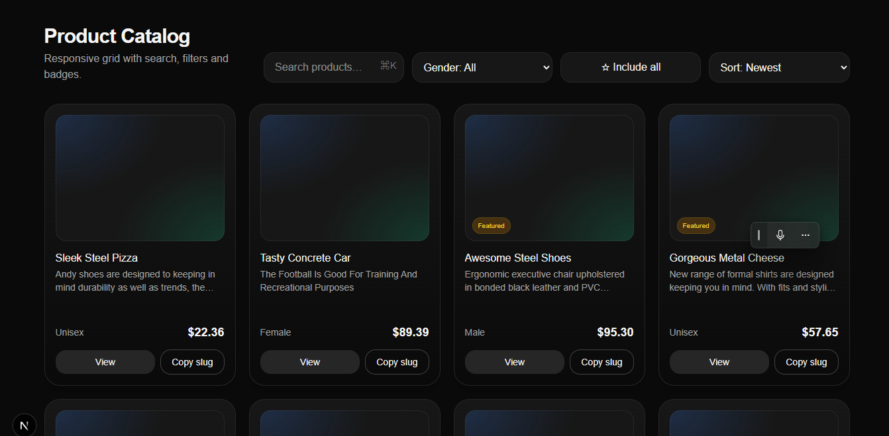

# Product Catalog Frontend (Next.js + Tailwind)


Responsive product grid built with *Next.js* (App Router) and *Tailwind CSS*, using mocked data for development.

## ✨ Features

- Responsive grid layout (1–4 columns depending on screen size)
- Search bar with instant filtering
- Gender filter (Male, Female, Unisex)
- “Featured only” toggle
- Sorting options: Newest, Price ↑, Price ↓, Name
- Product badges:
  - **Featured** (highlighted in amber)
  - **New** (created in last 30 days)
- Modern UI with soft gradients, shadows, and rounded corners
- Mocked product dataset for quick testing

## 🚀 Getting Started

### 1. Install dependencies

```bash
npm install
```

### 2. Run the development server

```bash
npm run dev
```

Open [http://localhost:3000](http://localhost:3000) to view in your browser.

### 3. Project Structure

```
app/
  page.tsx         # Main product grid page (mocked data)
  globals.css      # Tailwind base styles
```

### 4. Tech Stack

- **Next.js 14+** (App Router)
- **React 18**
- **Tailwind CSS**
- **TypeScript**

## 📦 Future Improvements

- Fetch products from the backend API instead of mocked data
- Add category names and filters
- Product detail page (`/product/[slug]`)
- Pagination or infinite scroll

## 📝 License

This project is open-sourced for portfolio/demo purposes.
