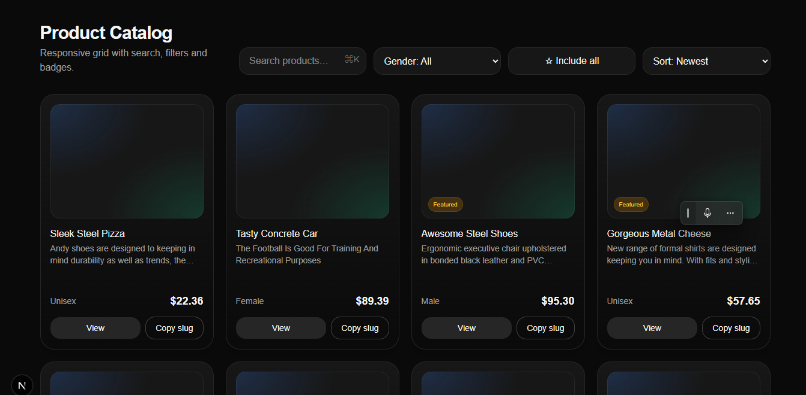

# Product Catalog Frontend (Next.js + Tailwind)


[](https://github.com/EudsonSouza/product-catalog-frontend/actions)
[](https://vitest.dev/)
[](https://www.typescriptlang.org/)


Responsive product grid built with *Next.js* (App Router) and *Tailwind CSS*, using mocked data for development.

## ✨ Features

- Responsive grid layout (1–4 columns depending on screen size)
- Search bar with instant filtering
- Gender filter (Male, Female, Unisex)
- “Featured only” toggle
- Sorting options: Newest, Price ↑, Price ↓, Name
- Product badges:
  - **Featured** (highlighted in amber)
  - **New** (created in last 30 days)
- Modern UI with soft gradients, shadows, and rounded corners
- Mocked product dataset for quick testing

## 🚀 Getting Started

### 1. Install dependencies

```bash
npm install
```

### 2. Run the development server

```bash
npm run dev
```

Open [http://localhost:3000](http://localhost:3000) to view in your browser.

### 3. Project Structure

```
app/
  page.tsx         # Main product grid page (mocked data)
  globals.css      # Tailwind base styles
```

### 4. Tech Stack

- **Next.js 14+** (App Router)
- **React 18**
- **Tailwind CSS**
- **TypeScript**

### 5. Testing

This project has comprehensive test coverage using Vitest and React Testing Library.

```bash
# Run tests in watch mode
npm test

# Run tests once
npm run test:run

# Run tests with coverage report
npm run test:coverage

# Open interactive UI
npm run test:ui
```

**Test Documentation:**
- 📊 **[Testing Stack Recommendation](./docs/testing-stack-recommendation.md)** - Tools and rationale
- 📋 **[Testing Implementation Plan](./docs/testing-implementation-plan.md)** - Roadmap to 80% coverage
- 🔧 **[Coverage Badge Setup](./docs/coverage-badge-setup.md)** - How to configure the coverage badge

**Current Coverage:** See badge above (target: 80%)

### 6. Development Guidelines

This project follows established best practices for Next.js and React development. For coding agents (Claude Code, Codex, etc.) and developers, please refer to our comprehensive development guidelines:

📚 **[Next.js & React Best Practices](./docs/next-react-best-practices.md)**

This documentation covers:
- Project structure and file organization
- Server vs Client Components patterns
- State management strategies
- Performance optimization techniques
- Testing approaches
- Code quality standards and naming conventions

Following these guidelines ensures consistent, maintainable, and performant code across the project.

## 📦 Future Improvements

- Fetch products from the backend API instead of mocked data
- Add category names and filters
- Product detail page (`/product/[slug]`)
- Pagination or infinite scroll

## 📝 License

This project is open-sourced for portfolio/demo purposes.
